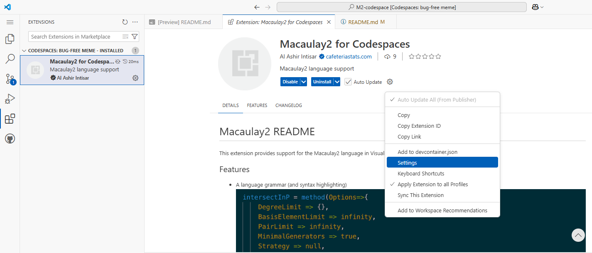
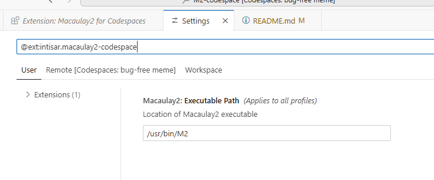
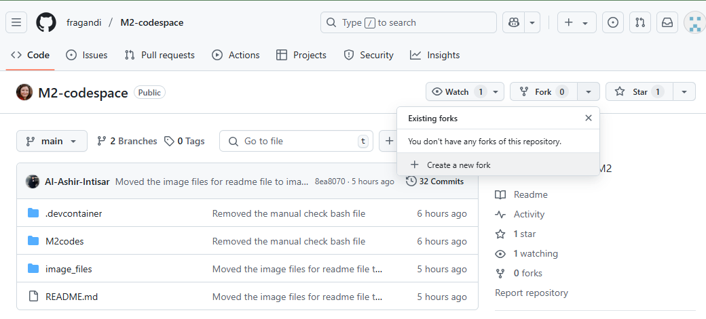
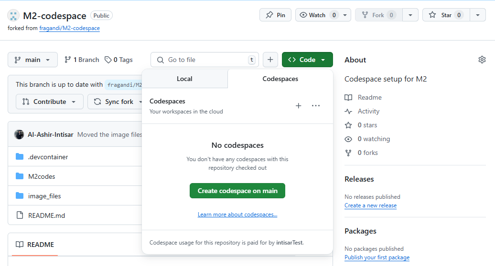

# InvariantRing
Macaulay2 package for computing invariants of group actions on polynomial rings.
For an overview of the package, please consult [arXiv:2010.15331](https://arxiv.org/abs/2010.15331).

More information about Macaulay2 available at [macaulay2.com](http://macaulay2.com).

# Macaulay2 (M2)-codespace
Codespace setup for Macaulay2 (M2)

## Checking if Codespace Was Set Up Properly

1. **Reload the VS Code window** to apply all settings:
   - Press `Cmd+Shift+P` (Mac) or `Ctrl+Shift+P` (Windows/Linux)
   - Search for and select: `Reload Window`

   Or run this in the Command Palette:


2. **Fix Macaulay2 executable path errors**:
If you see an error like “Cannot find Macaulay2 executable”, it's likely caused by conflicting user settings.

- To confirm this executable path error
- Go to the extension settings as shown in the image below:
<p align="center">
  
</p>
<p align="center">
  
</p>

- If your path is different than what it shows in the image above try the step below:

👉 To fix this, **turn off Settings Sync** in VS Code:

- Open the Command Palette (`Cmd/Ctrl + Shift + P`)
- Search for:  
  ```
  > Settings Sync: Turn Off
  ```

- Confirm when prompted.
- Reload the window or delete the existing codespace and create a new one if necessary.

3. **Check the Codespace creation log** to confirm Macaulay2 was installed correctly:
- Open the Command Palette (`Cmd/Ctrl + Shift + P`)
- Search for and select: `Codespaces: View Creation Log`
- Look for confirmation messages like:
  ```
  ✅ Macaulay2 installed successfully!
  ```


✅ Following all these steps ensures that only the settings configured in this repository are applied and Macaulay2 is ready to use inside your Codespace.


## 🚀 How to Create Your Own M2-Codespace Repository

There are two easy ways to set up your own Macaulay2-enabled Codespace:

### ✅ Option 1: Fork This Repository

1. Visit [fragandi/M2-codespace](https://github.com/fragandi/M2-codespace).

2. Click **"Fork"** (top-right) to copy it to your GitHub account.

<p align="center">
  
</p>

3. Open your new forked repository and click **"Code" → "Create codespace on main"**.

<p align="center">
  
</p>

You're ready to start using Macaulay2 in your own Codespace!

---

### 🛠️ Option 2: Set Up a Fresh Repository Manually

1. Create a new GitHub repository in your account.
2. Copy the entire `.devcontainer/` folder from [fragandi/M2-codespace](https://github.com/fragandi/M2-codespace) into your repo.
3. (Recommended) Also copy the following for a smoother experience:
   - The `M2codes/` folder (Macaulay2 example files)
   - The `image_files` folder and `README.md` file (for guidance and troubleshooting)
4. Push your changes and create a Codespace from the repository.

This option gives you more flexibility to customize your setup while keeping the essential Macaulay2 environment.


## Macaulay2 documentation website: 
- Visit: [The Macaulay2 Language](https://macaulay2.com/doc/Macaulay2/share/doc/Macaulay2/Macaulay2Doc/html/___The_sp__Macaulay2_splanguage.html)
